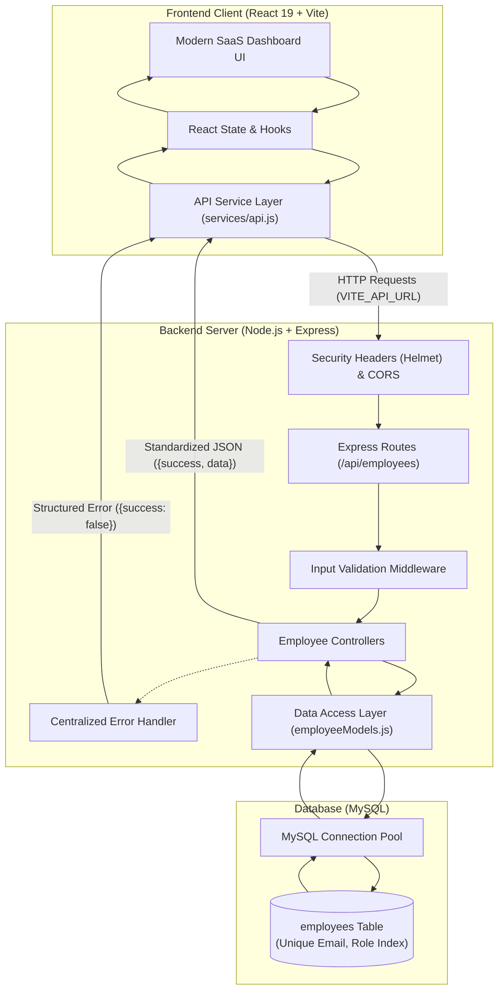

# Employee Management System

A polished, full-stack Employee Management System designed for managing organizational workforce directories, employee roles, contact information, and team statistics. Built with **React 19**, **Node.js**, **Express.js**, and **MySQL**, adhering to RESTful API principles, robust error handling, security best practices, and responsive design.

---

## Architecture Overview



---

## Features

- **Full Employee CRUD Operations**: Create, Read, Update, and Delete employees with immediate UI state updates.
- **Dynamic Dashboard Metrics**: Real-time KPI statistics cards calculated from live employee records (Total Employees, Active Roles, Top Department, Recently Onboarded).
- **Client-Side Search & Filter**:
  - Multi-field search across employee name, email, department/role, and employee ID.
  - Dynamic department/role filter dropdown.
  - Sorting options (Newest First, Oldest First, Name A–Z, Name Z–A).
- **Frontend Form Validation**:
  - Live client validation for full name, role, email format, and phone number lengths.
  - Trimmed whitespace, accessible error messages, and submit prevention while pending.
- **Defensive Backend Validation & Integrity**:
  - Server-side middleware verifying string lengths, email regex, phone formatting, and numeric ID params.
  - Pre-insertion duplicate email verification and MySQL `UNIQUE` key enforcement returning HTTP `409 Conflict`.
- **Accessible & Polite Feedback**:
  - Non-blocking auto-dismissing toast notifications for create, update, and delete actions.
  - Custom delete confirmation modal preventing accidental deletions.
  - Responsive table layout with horizontal scrolling and empty/skeleton loading states.
- **Lightweight Security**:
  - `helmet` integration for HTTP security headers.
  - Configurable CORS restricting client origins.
  - Parameterized SQL queries using `mysql2` to prevent SQL injection.
- **Health Check & Observability**:
  - Dedicated `/api/health` monitoring API uptime and database connectivity.

---

## Tech Stack

| Layer | Technologies |
| :--- | :--- |
| **Frontend** | React 19, Vite, CSS (Custom Design System with CSS variables), Zero-dependency SVG Icons |
| **Backend** | Node.js, Express.js (v5), Helmet, CORS, Dotenv |
| **Database** | MySQL (with `mysql2/promise` connection pool) |
| **Tooling** | Nodemon, ESLint |

---

## REST API Specification

Base URL: `http://localhost:5000/api`

| Method | Endpoint | Description | Request Body / Params | Status Codes |
| :--- | :--- | :--- | :--- | :--- |
| `GET` | `/health` | Server and MySQL health check | None | `200`, `503` |
| `GET` | `/employees` | Retrieve all employees | None | `200`, `500` |
| `GET` | `/employees/:id` | Retrieve single employee by ID | `:id` (Integer) | `200`, `400`, `404`, `500` |
| `POST` | `/employees` | Create a new employee | `{ name, role, email, phone }` | `201`, `400`, `409`, `500` |
| `PUT` | `/employees/:id` | Update an existing employee | `:id` (Integer), `{ name, role, email, phone }` | `200`, `400`, `404`, `409`, `500` |
| `DELETE` | `/employees/:id` | Delete an employee record | `:id` (Integer) | `200`, `400`, `404`, `500` |

### Sample JSON Response

**Success Response (200 OK):**
```json
{
  "success": true,
  "count": 2,
  "data": [
    {
      "id": 1,
      "name": "Priya Sharma",
      "role": "Frontend Engineer",
      "email": "priya.sharma@example.com",
      "phone": "+91 9876543210",
      "created_at": "2026-09-18T09:36:28.000Z"
    }
  ]
}
```

**Conflict Response (409 Conflict):**
```json
{
  "success": false,
  "message": "An employee with this email already exists."
}
```

---

## Database Setup

1. Start your local MySQL service (e.g., via MySQL Workbench, XAMPP, or command line).
2. Execute the schema script located at `backend/db/schema.sql`:

```sql
CREATE DATABASE IF NOT EXISTS employee_directory;
USE employee_directory;

CREATE TABLE IF NOT EXISTS employees (
    id INT AUTO_INCREMENT PRIMARY KEY,
    name VARCHAR(120) NOT NULL,
    role VARCHAR(120) NOT NULL,
    email VARCHAR(120) NOT NULL UNIQUE,
    phone VARCHAR(40) NOT NULL,
    created_at TIMESTAMP DEFAULT CURRENT_TIMESTAMP,
    INDEX idx_role (role),
    INDEX idx_created_at (created_at)
) ENGINE=InnoDB DEFAULT CHARSET=utf8mb4;
```

---

## Installation & Local Setup

### 1. Backend Setup

```bash
cd backend
npm install
```

Configure your environment variables in `backend/.env` (refer to `backend/.env.example`):
```env
PORT=5000
CLIENT_URL=http://localhost:5173
DB_HOST=localhost
DB_PORT=3306
DB_USER=root
DB_PASSWORD=your_password
DB_NAME=employee_directory
```

Start the backend server:
```bash
# Production mode
npm start

# Development mode with hot-reload
npm run dev
```

### 2. Frontend Setup

```bash
cd frontend
npm install
```

Configure your environment variable in `frontend/.env` (refer to `frontend/.env.example`):
```env
VITE_API_URL=http://localhost:5000/api
```

Start the Vite development server:
```bash
npm run dev
```

The frontend dashboard will be running at `http://localhost:5173`.

---

## Git & Version Control

To initialize and push this project to your GitHub repository:

```bash
# Initialize git repository (if not already initialized)
git init

# Add remote repository
git remote add origin https://github.com/Sriyokeshwar/employee-management-system.git

# Stage and commit clean files (node_modules and .env are protected by .gitignore)
git add .
git commit -m "feat: upgrade to full-stack employee management dashboard"

# Rename branch to main and push
git branch -M main
git push -u origin main
```

---

## Project Structure

```
My_project/
├── .env.example                # Root environment template
├── .gitignore                  # Root gitignore protecting secrets & build artifacts
├── README.md                   # Project documentation
│
├── backend/
│   ├── .env.example            # Backend env template
│   ├── .gitignore              # Backend ignore rules
│   ├── package.json
│   ├── server.js               # Express application entry point & health check
│   ├── config/
│   │   └── db.js               # MySQL connection pool configuration
│   ├── controllers/
│   │   └── employeeControllers.js # Request handlers & status code handling
│   ├── db/
│   │   └── schema.sql          # Reproducible SQL schema and indexes
│   ├── middleware/
│   │   ├── errorHandler.js     # Centralized error handler & 404 handler
│   │   └── validator.js        # Request validation middleware
│   ├── models/
│   │   └── employeeModels.js   # Parameterized SQL data access methods
│   └── routes/
│       └── employeeRoutes.js   # API route definitions
│
└── frontend/
    ├── .env.example            # Frontend env template
    ├── .gitignore              # Frontend ignore rules
    ├── index.html              # HTML shell
    ├── package.json
    ├── vite.config.js
    └── src/
        ├── App.jsx             # Main dashboard container & state coordinator
        ├── App.css             # Cohesive SaaS design system styles
        ├── main.jsx            # React root mount
        ├── components/
        │   ├── DeleteConfirmModal.jsx # Destructive action confirmation dialog
        │   ├── EmployeeModal.jsx      # Add / Edit employee modal with validation
        │   ├── EmployeeTable.jsx      # Data table with avatars & action buttons
        │   ├── Header.jsx             # Top bar with health indicator & CTA
        │   ├── Icons.jsx              # Lightweight SVG icon collection
        │   ├── LoadingSkeleton.jsx    # Table placeholder skeleton rows
        │   ├── SearchBar.jsx          # Live search, role filter & sort controls
        │   ├── StatsCards.jsx         # Dynamic KPI employee metrics cards
        │   └── Toast.jsx              # Auto-dismissing feedback notifications
        └── services/
            └── api.js                 # Centralized REST API client
```
